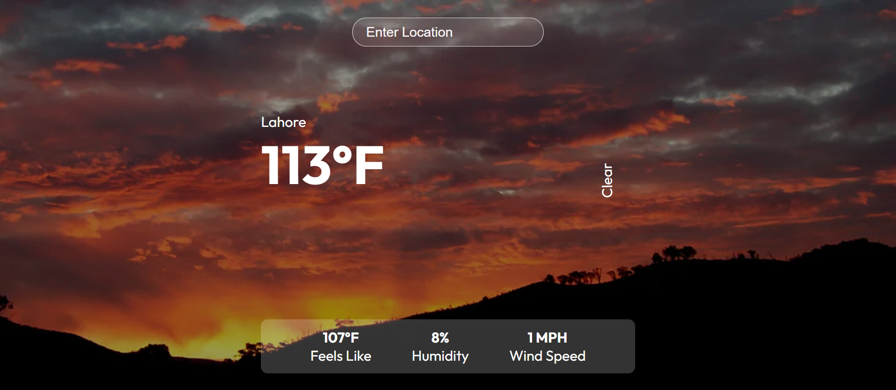

# 🌦️ Weather App

Welcome to **Weather App**, a clean and responsive weather forecast application powered by the OpenWeatherMap API. Enter any city name to get real-time weather information, including temperature, humidity, wind speed, and a brief forecast summary.

🌐 **Live Demo:**  
👉 [Click here to view the app](https://weatherwhiz-kappa.vercel.app/)

---

## ✨ Features

- 🔍 Search for any city worldwide
- 📍 Get real-time temperature, humidity, wind speed, and "feels like" data
- 🌤️ Dynamic weather descriptions (e.g., Clear, Rainy, Cloudy)
- 🖥️ Clean and responsive UI built with React
- 📡 Powered by OpenWeatherMap API

---

## 🔧 Technologies Used

- **React** – For building the user interface
- **TypeScript** – Ensures type safety and better developer experience
- **Axios** – For making HTTP requests
- **OpenWeatherMap API** – Source of weather data
- **Vercel** – For deployment

---



## 🚀 Getting Started (Local Setup)

1. Clone the repository:
   ```bash
   git clone https://github.com/your-username/weather-app.git
   cd weather-app
   ```

Made with ❤️ by [Attiqa Zaki](https://github.com/Attiqa-Z)
